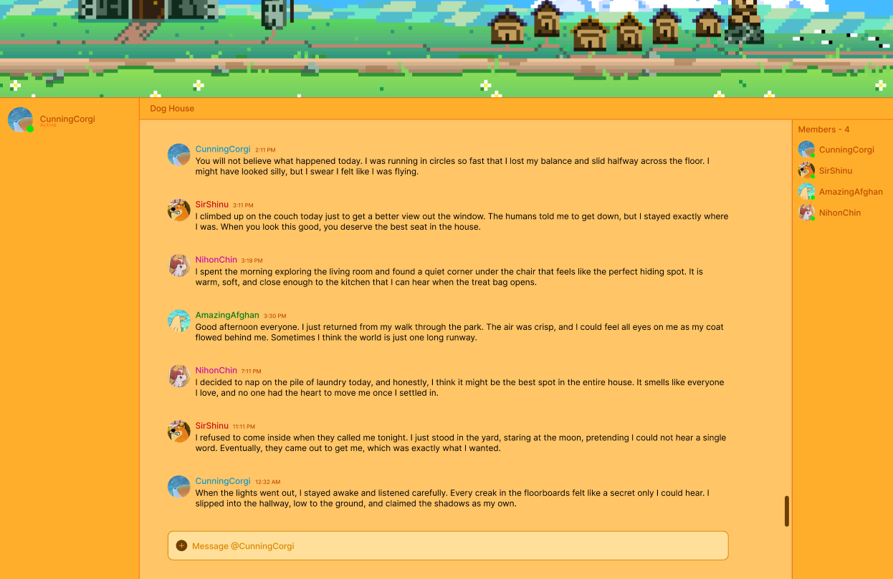

# Dogoo Chat

## Description
Dogoo Chat is a very basic desktop app that allows real-time messaging between clients with a fun, engaging UI.

## Tech Stack
- Electron - desktop app framework for cross-platform apps 
- Sockets.IO - real-time messaging between clients
- HTML, CSS, JS - frontend 
- Tailwind CSS - utility-based CSS framework to make styling faster
- Daisy UI - tailwind plugin providing prebuilt UI components

## Features 
- Feature 1 - Real-time message between clients using Sockets 
- Feature 2 - Usernames / User-identification (e.g., CunningCorgi, NihonChin, etc.) 
- Feature 3 - Detect and modify activity status 
- Feature 4 - Allow images to be sent in messages 
- Feature 5 - Display data of message sent

## Future Features
- Feature 1 - Message filter
- Feature 2 - Mobile integration 
- Feature 3 - Friends
- Feature 4 - Groups
- Feature 5 - Profiles / Customizable Settings

## MFP - Figma

## DFD - Miro

## Link to Design Document 
### [Design Document](docs/Dogoo-Chat-Design-Document.pdf)